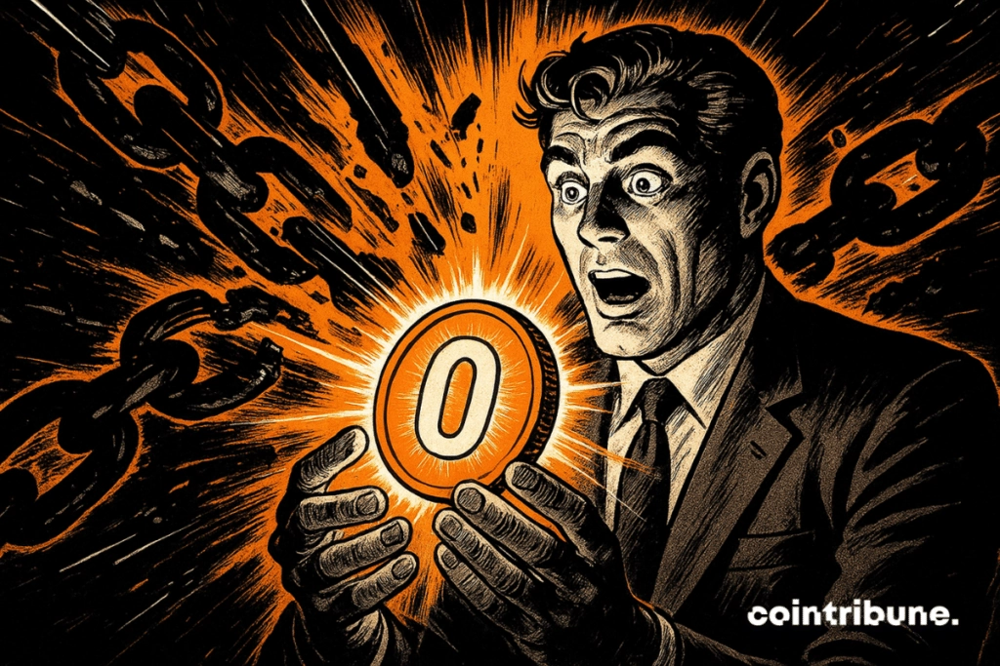

# OKX整合USDT0：重新定义DeFi流动性的游戏规则

2025年9月9日，OKX宣布在其Layer 2网络X Layer上部署USDT0，这不是简单的技术升级——而是彻底改变多链操作体验的关键一步。如果你还在为跨链转账支付高昂手续费、忍受漫长等待时间，或者因为复杂的桥接操作错失交易机会，那么现在是时候重新审视你的交易平台选择了。

---

## USDT0到底解决了什么真实痛点？

传统的稳定币使用就像在不同城市之间搬家——每次换个地方都要重新办手续、交过路费，还得担心东西在路上丢了。USDT0基于LayerZero的全链可替代代币标准，让这一切变得像在同一栋楼里换房间一样简单。

具体来说，你可以在**X Layer、Arbitrum、Optimism、Unichain、Berachain和Polygon**这十几个生态系统之间自由移动资产，不需要第三方桥接，不需要额外等待。👉 [立即体验零门槛跨链操作](https://www.okx.com/join/62834398)

这意味着什么？比如你在Arbitrum上看到一个收益率不错的流动性池，几秒钟就能把资金从X Layer转过去；发现Optimism上有更好的套利机会，立刻能调整仓位——整个过程就像在同一个平台内部操作一样流畅。

以前那些只有机构交易员才玩得转的复杂策略，现在普通用户也能轻松上手了。

## OKX不只是交易所，更是完整的Web3基础设施

很多人对OKX的印象还停留在"一个交易平台"，但实际情况已经完全不同。

OKX支持超过350种加密货币，在160多个国家开展业务，这些数字背后是一套成熟的基础设施。最关键的是X Layer——这个自有的以太坊Layer 2网络不是装饰品，而是整个生态的技术支柱。

USDT0原生部署在X Layer上，这让OKX用户获得了其他平台暂时无法提供的能力：无缝的多链流动性管理。当竞争对手还在为桥接问题头疼时，OKX用户已经在利用跨链价格差异赚取收益了。

安全性方面，OKX达到了机构级标准（这不是营销话术，是实打实的监管合规和技术投入），同时保持了创新速度。这种平衡很难做到，但对用户来说意味着既能放心存放大额资产，又不会错过新兴机会。

## 真正的优势在操作层面

理论上的技术创新听起来都很美好，但实际使用体验才是关键。

假设你有一笔USDT闲置资金。传统方式下，你需要：
1. 在A链上找到合适的协议
2. 通过桥接工具转移资产（等待时间+手续费）
3. 在B链上完成操作
4. 如果发现更好机会，重复上述流程

用OKX和USDT0？直接在X Layer、Arbitrum、Optimism之间切换，几秒钟完成。省下的时间和手续费是次要的，真正重要的是不会因为操作复杂而错过稍纵即逝的市场机会。

这种流畅度对于需要频繁调整策略的交易者来说，是决定性的竞争优势。

OKX的Web3生态覆盖超过1000个DApp协议、集成NFT市场、提供收益耕作工具——所有这些都在统一的安全框架下运行。不用在多个平台之间跳转，不用担心各种钱包和协议的兼容性问题，一切都已经准备就绪。

## 为什么现在加入OKX是明智选择？

时机很关键。USDT0刚刚上线，早期采用者能享受到竞争对手几个月内都难以复制的功能优势。这个窗口期不会持续太久。

更重要的是，OKX展现出的战略眼光和执行能力值得信赖。他们不是在炒作概念，而是在实际解决用户痛点——从日均数十亿美元的交易量、数百万活跃用户，到24/7多语言支持和持续的功能迭代，每个细节都在说明这是一个认真做事的平台。

当传统金融机构开始大规模进入加密市场时，能同时提供机构级安全和前沿技术的平台将占据绝对优势。👉 [现在注册OKX，使用邀请码62834398](https://www.okx.com/join/62834398)

---

## 总结

USDT0的整合标志着链上金融进入新阶段——技术障碍正在消失，用户体验变得直观流畅。OKX通过自有Layer 2网络、完整的DeFi生态和机构级安全标准，已经构建起下一代去中心化金融基础设施。

正如OKX所说："无论你在Web3的哪个角落，你的稳定币都应该跟随你。"这不是口号，而是通过USDT0和X Layer实现的实际能力。对于希望在多链环境中高效操作的用户来说，[OKX已经成为不可忽视的选择](https://www.okx.com/join/62834398)，因为它解决了其他平台仍在回避的核心问题：真正的跨链流动性自由。
